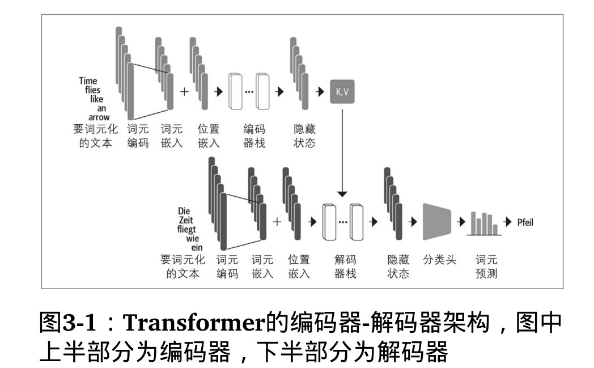
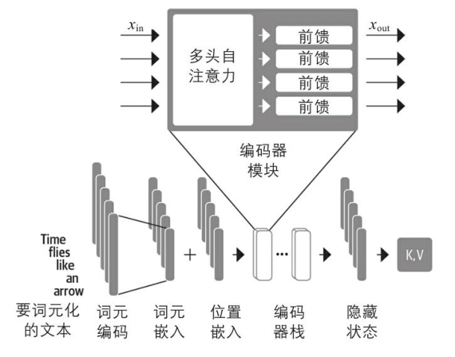

# Transformer 架构

原始Transformer是基于编码器-解码器架构的，该架构广泛用于机器翻译等任务中  
即将一个单词序列从一种语言翻译成另一种语言。

该架构由两个组件组成:

* 编码器：将一个词元的输入序列转化为一系列嵌入向量，通常被称为隐藏状态或上下文
* 解码器：利用编码器的隐藏状态，逐步生成一个词元的输出序列，每次生成一个词元

## 编码器

每个编码器层接收一系列嵌入，然后通过以下子层进行馈送处理：

* 一个多头自注意力层。
* 一个全连接前馈层，应用于每个输入嵌入。

每个编码器层的输出嵌入尺寸与输入嵌入相同，我们很快就会看到编码器堆叠的主要作用是“更新”输入嵌入，以产生编码一些序列中的上下文信息的表示。例如，如果单词“苹果”附近的单词是“主题演讲”或“电话”，那么该单词将被更新为更像“公司”的特性，而不是更像“水果”的特性。

### 自注意力机制

注意力机制是一种神经网络为序列中的每个元素分配不同权重或“注意力”的机制。

自注意力中的“自”指的是这些权重是针对同一组隐藏状态计算的，例如编码器的所有隐藏状态。

自注意力的主要思想是，不是使用固定的嵌入值来表示每个词元，而是使用整个序列来计算每个嵌入值的加权平均值。另一种表述方式是说，给定词元嵌入的序列$x，…，x，$自注意力产生新的嵌入序列，其中每个是所有x的线性组合：

$$
x^{'}_{i}=\sum^{n}_{j=1} \mathcal{W}_{ji} \mathcal{X}_{j}
$$

其中的系数$\mathcal{W}_{ji}$称为注意力权重，其被规范化以使得$\sum_{j}\mathcal{W}_{ji}=1$

缩放点积注意力实现步骤：

1. 将每个词元嵌入投影到三个向量中，分别称为query,key和value。
2. 计算注意力分数。我们使用相似度函数确定query和key向量的相关程度。顾名思义，缩放点积注意力的相似度函数是点积，并通过嵌入的矩阵乘法高效计算。相似的query和key将具有较大的点积，而那些没有相似处的则几乎没有重叠。这一步的输出称为注意力分数，在一个有n个输入词元的序列中，将对应着一个n×n的注意力分数矩阵。
3. 计算注意力权重。点积在一般情况下有可能会产生任意大的数，这可能会导致训练过程不稳定。为了处理这个问题，首先将注意力分数乘以一个缩放因子来规范化它们的方差，然后再通过softmax进行规范化，以确保所有列的值相加之和为1。结果得到一个n×n的矩阵，该矩阵包含了所有的注意力权重$w_{ji}$。
4. 更新词嵌入。计算完注意力权重之后，我们将它们与值向量$v，…，v$相乘，最终获得词嵌入表示。
  
$$
\begin{align}
  x^{'}_{i} = \sum_{j}w_{ji}v_{j}
\end{align}
$$
